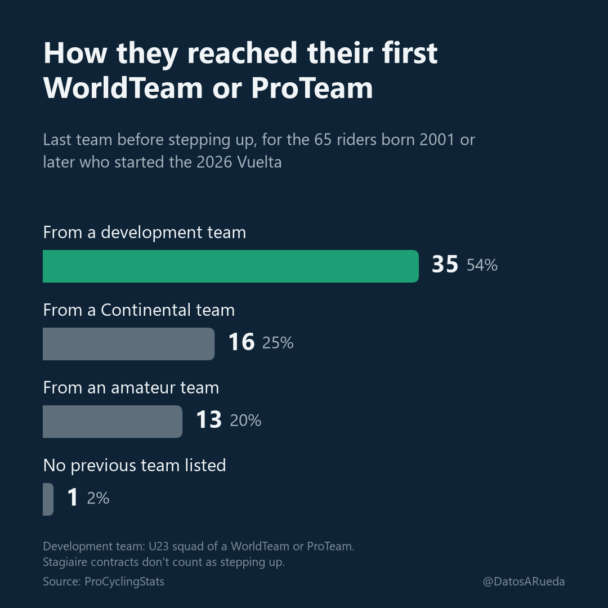
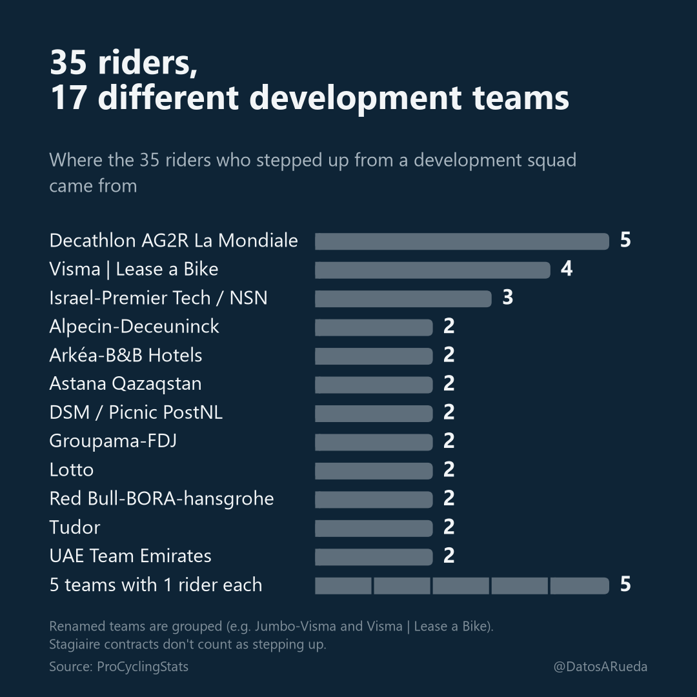
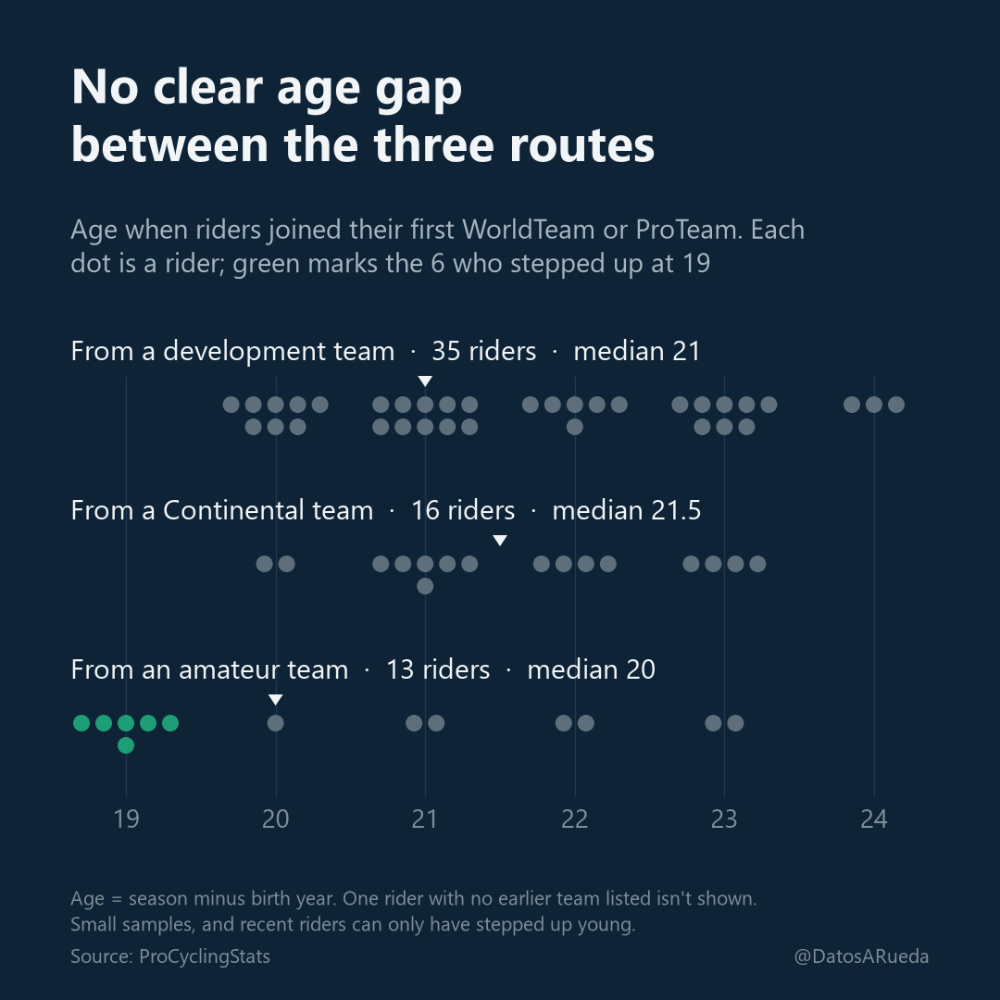
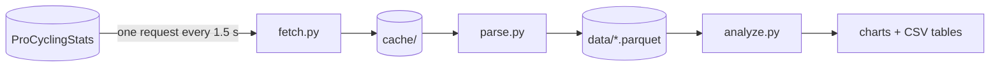

<h1 align="center">datos-a-rueda</h1>

<p align="center">
  <strong>Pathways into the professional peloton</strong><br>
  How the young riders of the 2026 Vuelta a España reached the top tier
</p>

<p align="center">
  
  
  <a href="https://x.com/DatosARueda"></a>
</p>

<p align="center">
  
</p>

## Findings

Riders born in 2001 or later who started the 2026 Vuelta (65 riders), with ProCyclingStats data downloaded on 13 September 2026.

- **Most stepped up through a development team.** 35 of the 65 joined their first WorldTeam or ProTeam straight from one; 16 came from a Continental team and 13 from an amateur team.
- **No single development team dominates.** Those 35 came from 17 different development teams, and none produced more than 5 (counting renamed teams as one).
- **The route doesn't clearly change the age.** Median age at the step up is 21 via a development team, 21.5 via a Continental team and 20 via an amateur team, and the gap doesn't hold up with samples this small. The only riders who stepped up at 19 came from amateur teams (6 of 13).

<table>
  <tr>
    <td width="50%"></td>
    <td width="50%"></td>
  </tr>
</table>

## How it works

Three separate layers; each one only reads the output of the previous one, and only `fetch.py` touches the network.



| Layer | Does |
|---|---|
| `fetch.py` | Downloads PCS pages into `cache/`, one file per URL, never twice |
| `parse.py` | Reads `cache/` and writes `data/riders.parquet`, `data/teams.parquet` and `data/riders.csv` |
| `analyze.py` | Reads the parquet files and writes the three charts and their tables |

| Output (`data/`) | What it shows |
|---|---|
| `pathways.png` / `.csv` | How riders reached their first WorldTeam or ProTeam: from a development team, a Continental team, an amateur team, or with no previous team listed |
| `development_teams.png` / `.csv` | For riders who stepped up straight from a development team, how many came from each one (renamed teams grouped) |
| `age_by_route.png` / `.csv` | Age when joining the first WorldTeam or ProTeam, by route of entry, one dot per rider, with permutation tests on the differences |

The charts shown above are copies in `docs/img/`.

## Quick start

```bash
python -m venv .venv
.venv\Scripts\activate        # Windows; on macOS/Linux: source .venv/bin/activate
pip install procyclingstats requests beautifulsoup4 lxml pandas pyarrow matplotlib
python fetch.py riders --born-from 2001
python parse.py
python analyze.py
```

`fetch.py` needs an identifying User-Agent in `user_agent.txt` (git-ignored), e.g. `Your Name (https://x.com/your_handle)`.

All three outputs are reproduced by running `fetch.py`, `parse.py` and `analyze.py`, in that order, with PCS data as of the download date.

## Method notes

<details>
<summary>Definitions and judgement calls</summary>

- **Cohort:** startlist riders born in 2001 or later (UCI birth-year rule).
- **Step up:** first spell at a WorldTeam or ProTeam. The route is the level of the last team before it.
- **Stagiaires:** trainee contracts never count as the step up, nor as the team before it.
- **Development teams:** listed by name. Renamed teams are grouped under one sponsor line; grouping Israel Premier Tech Academy with NSN Development Team is a judgement call based on the timing of the names and on riders moving between the two structures. Five teams that carry a WorldTeam or ProTeam brand but aren't named as development squads (e.g. Hagens Berman Jayco, EF Education - Aevolo) are not counted as development teams; including them would raise 35 to 40.
- **Ages:** season minus birth year. Riders born in 2005–06 can only have stepped up young, and PCS covers amateur racing unevenly, especially outside Western Europe.

More detail in [`BRIEF.md`](BRIEF.md) (in Spanish) and in the docstrings of `parse.py` and `analyze.py`.

</details>

## Data use rules

- **Rate limit:** at least 1.5 s between requests. A URL already in `cache/` is never requested again. Retries on 429/5xx use exponential backoff.
- **No Cloudflare evasion:** requests carry a real, identifying User-Agent. If PCS answers 403 or a Cloudflare challenge, `fetch.py` stops. The `procyclingstats` package is used only to parse cached HTML, never to download, because its fetcher spoofs a browser and can use `cloudscraper`.
- **PCS is the cited source** of every figure derived from this project.
- **No redistribution:** the downloaded pages (`cache/`) and the dataset (`data/`) are not published in this repository; only the aggregate charts are.

---

<p align="center">
  Data: <a href="https://www.procyclingstats.com/">ProCyclingStats</a> · Analysis: <a href="https://x.com/DatosARueda">@DatosARueda</a>
</p>
